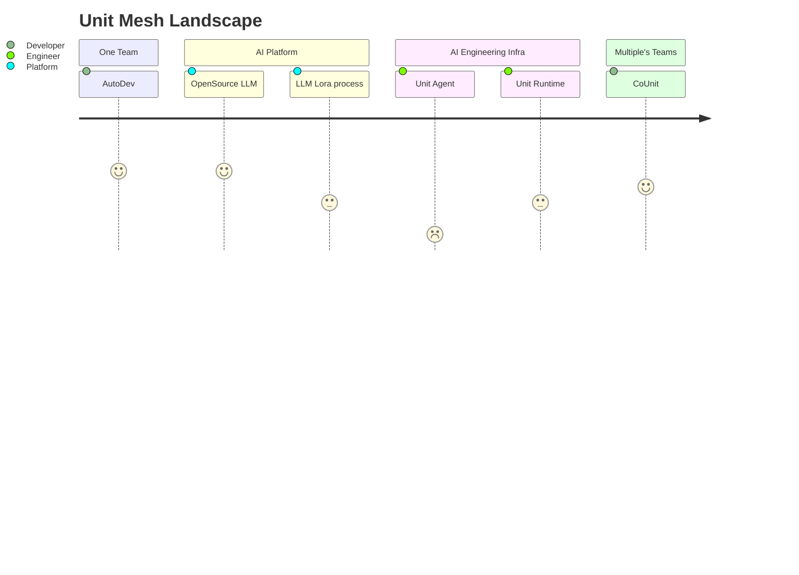
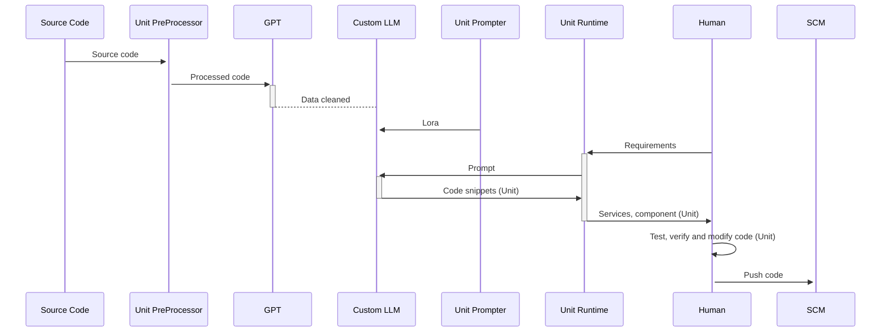

## Hi there 👋

Our projects:

| Scene                           | Project Name   | Link                                                      | Description    |
|---------------------------------|----------------|-----------------------------------------------------------|----------------|
| IDE Copilot tool for developer  | AutoDev        |  [AutoDev](https://github.com/unit-mesh/auto-dev)         | The AI-powered coding wizard with multilingual support 🌐, auto code generation 🏗️, and a helpful bug-slaying assistant 🐞! Customizable prompts 🎨 and a magic Auto Testing feature 🧪 included! 🚀 |
| Opensource LLM + LoRA           | DevTi          | [DevTi](https://github.com/unit-mesh/devti)               | DevTi an open-source project that leverages a large language model to enhance development efficiency by providing intelligent solutions, helping developers efficiently complete tasks like automated user task breakdown, user story generation, automatic code generation, and testing. |
| Opensource LLM + LoRA tutorials | Unit Minions   | [Unit Minions](https://github.com/unit-mesh/unit-minions) | 《AI 研发提效研究：自己动手训练 LoRA》，包含 Llama （Alpaca LoRA）模型、ChatGLM （ChatGLM Tuning）相关 Lora 的训练。 | 
| Collaboration AI for team       | CoUnit         | [CoUnit](https://github.com/unit-mesh/co-unit)            | Merge artificial intelligence seamlessly with team collaboration. Leverage intelligent vectorization to process documents, knowledge bases, SDKs, and APIs, empowering teams to unleash their creativity.  |
| LSP Agent                       | Unit Agent     | [Unit Agent](https://github.com/unit-mesh/unit-agent)     | the Unit Mesh agent for Language Server Protocol, Agent proxy... |
| Code Interpreter                | Unit Runtime   | [Unit Runtime](https://github.com/unit-mesh/unit-runtime) | Unit Runtime is an efficient and user-friendly AI code execution environment that allows for one-click startup and real-time interaction, helping you quickly build and test AI code.  |
| VSCode plugin for developer     | VS Code plugin | [auto-dev-vscode](https://github.com/unit-mesh/auto-dev-vscode)  | VSCode plugin ...      |

Full Landscape

LoRA work processes

<!--

**Here are some ideas to get you started:**

🙋‍♀️ A short introduction - what is your organization all about?
🌈 Contribution guidelines - how can the community get involved?
👩‍💻 Useful resources - where can the community find your docs? Is there anything else the community should know?
🍿 Fun facts - what does your team eat for breakfast?
🧙 Remember, you can do mighty things with the power of [Markdown](https://docs.github.com/github/writing-on-github/getting-started-with-writing-and-formatting-on-github/basic-writing-and-formatting-syntax)
-->
