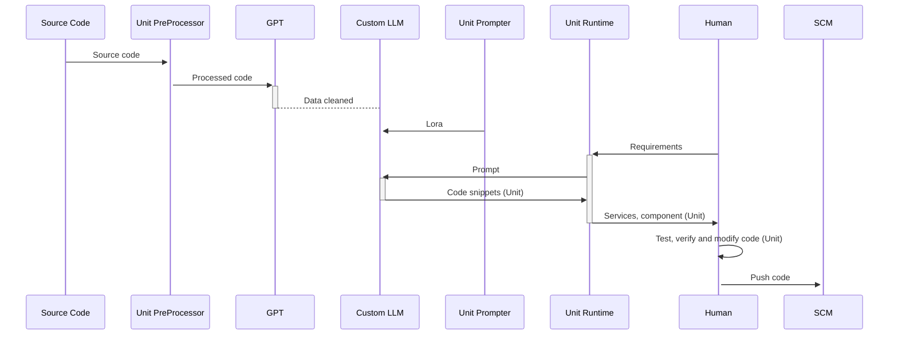

## Hi there 👋

our projects:

- Opensource LLM + LoRA: [DevTi](https://github.com/unit-mesh/devti) s an open-source project that leverages a large language model to enhance development efficiency by providing intelligent solutions, helping developers efficiently complete tasks like automated user task breakdown, user story generation, automatic code generation, and testing.
- IDE plugin: [AutoDev](https://github.com/unit-mesh/auto-dev) 🧙‍AutoDev: The AI-powered coding wizard with multilingual support 🌐, auto code generation 🏗️, and a helpful bug-slaying assistant 🐞! Customizable prompts 🎨 and a magic Auto Testing feature 🧪 included! 🚀
- Collaboration AI for team: [CoUnit](https://github.com/unit-mesh/co-unit) Merge artificial intelligence seamlessly with team collaboration. Leverage intelligent vectorization to process documents, knowledge bases, SDKs, and APIs, empowering teams to unleash their creativity. 
- [Unit Agent](https://github.com/unit-mesh/unit-agent).  the Unit Mesh agent for Language Server Protocol, Agent proxy...
- [Unit Runtime](https://github.com/unit-mesh/unit-runtime). is an efficient and user-friendly AI code execution environment that allows for one-click startup and real-time interaction, helping you quickly build and test AI code.
- VS Code plugin: [auto-dev-vscode](https://github.com/unit-mesh/auto-dev-vscode)

会议相关问题 --> [QCon](https://github.com/unit-mesh/conf)

<!--

**Here are some ideas to get you started:**

🙋‍♀️ A short introduction - what is your organization all about?
🌈 Contribution guidelines - how can the community get involved?
👩‍💻 Useful resources - where can the community find your docs? Is there anything else the community should know?
🍿 Fun facts - what does your team eat for breakfast?
🧙 Remember, you can do mighty things with the power of [Markdown](https://docs.github.com/github/writing-on-github/getting-started-with-writing-and-formatting-on-github/basic-writing-and-formatting-syntax)
-->
